# The 7 DOF Franka Emika Panda robot


## Table of Content

- [The 7 DOF Franka Emika Panda robot](#the-7-dof-franka-emika-panda-robot)
  - [Table of Content](#table-of-content)
  - [The robotic arm](#the-robotic-arm)
    - [Robot modelling](#robot-modelling)
    - [Overview of the Implemented Controllers](#overview-of-the-implemented-controllers)
      - [Non adaptive](#non-adaptive)
      - [Adaptive Methods](#adaptive-methods)
    - [Code Structure](#code-structure)
    - [Reference Trajectories](#reference-trajectories)
    - [Pick and Place](#pick-and-place)
      - [Trajectory definition](#trajectory-definition)
      - [Dynamic simulation](#dynamic-simulation)
      - [Independent PD controller](#independent-pd-controller)
        - [Case I: Robot gravity is ignored](#case-i-robot-gravity-is-ignored)
        - [Case II: Robot gravity is no longer ignored](#case-ii-robot-gravity-is-no-longer-ignored)
        - [Case III: Gravity Compensation](#case-iii-gravity-compensation)
    - [Independent PID controller](#independent-pid-controller)
      - [PID Without gravity compensation](#pid-without-gravity-compensation)
      - [PID With gravity compensation](#pid-with-gravity-compensation)
    - [Computed Torque](#computed-torque)
    - [Computed torque Robustness and errors in the dynamical model](#computed-torque-robustness-and-errors-in-the-dynamical-model)
    - [Pick and Place Results Overview](#pick-and-place-results-overview)
  - [Trajectory Tracking](#trajectory-tracking)
      - [The Backstepping Control](#the-backstepping-control)
      - [Backstepping controller implementation](#backstepping-controller-implementation)
      - [Response to different trajectories speed and amplitude](#response-to-different-trajectories-speed-and-amplitude)
  - [Perturbations of Dynamical parameters and Adaptive strategies](#perturbations-of-dynamical-parameters-and-adaptive-strategies)
    - [Dynamic Regressor](#dynamic-regressor)
    - [New Trajectories for the adaptive control](#new-trajectories-for-the-adaptive-control)
    - [Adaptive Computed Torque](#adaptive-computed-torque)
      - [Adaptive computed torque implementation:](#adaptive-computed-torque-implementation)
      - [Adaptive computed torque results](#adaptive-computed-torque-results)
      - [Adaptive computed torque limits](#adaptive-computed-torque-limits)
    - [Li Slotine Controller](#li-slotine-controller)
      - [Li Slotine Implementation](#li-slotine-implementation)
      - [Li Slotine Results](#li-slotine-results)
    - [Adaptive Backstepping Control](#adaptive-backstepping-control)
      - [Adaptive Backstepping Implementation](#adaptive-backstepping-implementation)
      - [Adaptive Backstepping Results](#adaptive-backstepping-results)
  - [Overview of the Results](#overview-of-the-results)
    - [Final remarks](#final-remarks)


## The robotic arm

This  7 DOF Franka Emika Panda robot is  equipped  with 7 revolute joints, each mounting a torque sensor, and it has a total weight of approximately 18kg, having the possibility to handle payloads up to 3kg.

  Figure 1 shows  the  Franka  Emika  Panda  robot, its geometrical parameters and the used DH convention.   

<p align="center">
  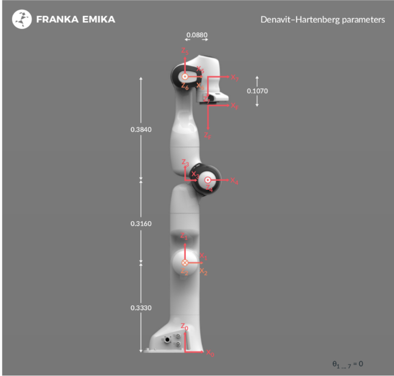
</p>


### Robot modelling

The first step was to model the robot using Matlab Robot Control toolbox.

The robot is defined according to the DH table and its parameter are defined and assigned. This is done in 
```robot_gen.m```

The model is saved as ```PANDA```.

The following paramters are used: 
<!-- $$d1 = 0.333;d3=0.316;d5=0.384;a4=0.0825;a5=-0.0825;a7=0.088;$$
$$m1=3.4525; m2=3.4821; m3=4.0562; m4=3.4822; m5=2.1633; m6=2.3466; m7=0.31290;$$ -->


The parameters are found in  [this online repository](https://github.com/marcocognetti/FrankaEmikaPandaDynModel.git) while the exact procedure is described here:

[Dynamic Identification of the Franka Emika Panda Robot with Retrieval of Feasible Parameter Using Penalty-based Optimization](https://hal.inria.fr/hal-02265293/document)

The resulting model is: 

<!-- <p align="center">

</p>

Following the Denavit-Hartenberg convention: -->

<!-- $$ L1 = Link([0,d1,  0,  0]), $$
$$ L2 = Link([0,0, 0,  -pi/2])   $$
$$ L3 = Link([0,d3, 0,  pi/2])   $$
$$ L4 = Link([0,0,  a4,  pi/2])   $$
$$ L5 = Link([0,d5,  a5,  -pi/2])   $$
$$ L6 = Link([0,0,  0,  pi/2])   $$
$$ L7 = Link([0,0,  a7,  pi/2])   $$ -->


<p align="center">
  <!--  -->
  
  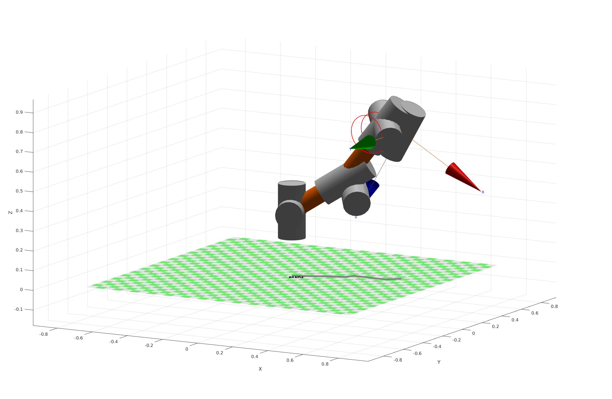
</p>


Once we have the dynamical model properly set up, we can proceed to implement the controllers.

### Overview of the Implemented Controllers


#### Non adaptive


|                              | Pick and Place     | Circumference      | Helix              |
| ---------------------------- | ------------------ | ------------------ | ------------------ |
| PD                           | :heavy_check_mark: | :x:                | :x:                |
| PD with gravity compensation | :heavy_check_mark: | :x:                | :x:                |
| PID                          | :heavy_check_mark: | :x:                | :x:                |
| Computed torque              | :heavy_check_mark: | :heavy_check_mark: | :heavy_check_mark: |
| Backstepping                 | :x:                | :heavy_check_mark: | :heavy_check_mark: |

####  Adaptive Methods 

|                          | Pick and Place     | Circumference      | Helix              |
| ------------------------ | ------------------ | ------------------ | ------------------ |
| Adaptive Computed Torque | :heavy_check_mark: | :heavy_check_mark: | :heavy_check_mark: |
| Adaptive Backstepping    | :x:                | :heavy_check_mark: | :heavy_check_mark: |
| Li Slotine               |:x: | :heavy_check_mark: |  :heavy_check_mark: |


### Code Structure

Before I dive into the report, I would line to outline the code structure. In the repository, there are essentially three folders. 
- Pick and place: It contains every result for the pick and place simulation. Every controller will be found in 
```
./pick_and_place_results/pickandplace_ (desired controller).m
```
like: 
```
./pick_and_place_results/pickandplace_computedtorque.m
```
Most of the results are already stored as (desired controller)_results.mat

Comparative plots for the pick and place scenario can be found in 

```
./pick_and_place_results/plot_results.m
```


- Non adaptive control

All the results are found in:

```
./non_adaptive_results/non_adaptive_trajectory_tracking.m
```

In the file, the following sections are found:

1. Choose Trajectory (Helix or Circumference)
2. Setup
3. Compute Reference Trajectory (Cartesian to joint space)
4. Execute the computed trajectory with the robot
5. Trajectory Tracking: Computed Torque Method
6. Computed Torque Results
7. Trajectory Tracking: Backstepping Method
8. Backstepping Results
9. Comparison


- Adaptive control
  
All the results are found in:

```
./adaptive_results/adaptive_trajectory_tracking.m
```

In this file, another manipulator was chosen, as I encountered difficulties in the computation of the dynamic regressor for the Franka 7 DOF arm (and even for a 5 dof simplyfied version of it).
Therefore, I switched to the arm implemented in the robotics toolbox, the KUKA 5 DOF robot.

This file has a similar structure: in the first section the trajectory is computed, then the Computed Torque and Backstepping controller are calculated exactly as before. At the end, the mass of the model is modified and the Adaptive Controllers are implemented.

Each implementation will be specifically addressed in the respective adaptive controller section.

### Reference Trajectories

I defined three reference trajectories:

|   Pick and Place	|   Circumference	|   Helix	|
|---	|---	|---	|
|   	|   	|   	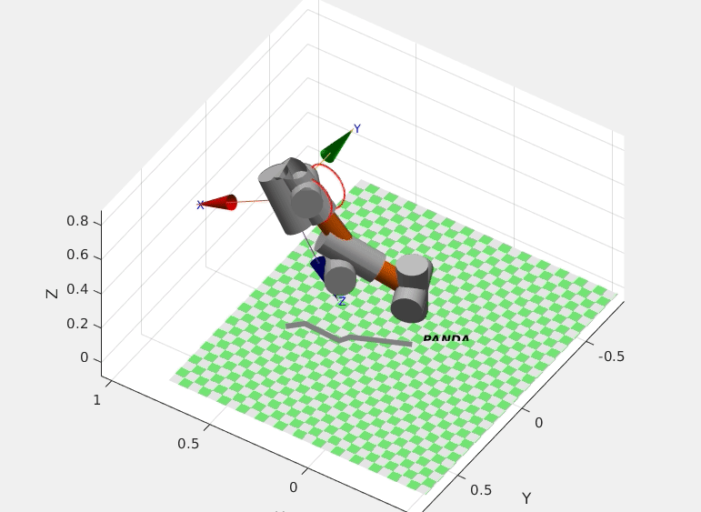|

Each trajectory will now be discussed in details with the implemented controllers.

### Pick and Place

#### Trajectory definition

Initial Conditions


<!-- $$ q_{ini} = [0, 0, 0, 0, 0, 0, 0] $$ -->

Final Conditions


<!-- $$ q_{des} = [pi/3, 0, pi/3, pi/3, pi/6, 0 , 0]$$ -->


#### Dynamic simulation

Starting from the initial conditions I compute the following quantities in a for loop over a 10s period with time constant 1ms :

- Error, derivate of the error, integral of the error

<!-- $$ err = q_{des} - q $$
$$ \frac {\partial err}{\partial t} = \frac {\partial (q_{des}-q)}{\partial t}  $$
$$ \Delta ierr=(err+err_{old})*\delta_{t/2} $$ -->

- Dynamic matrices

<!-- $$ F = \text{FrictionTorque}(dq) $$ 
$$ G = \text{GravityVector(q)} $$
$$ C = \text{CoriolisVector(q,dq)} $$
$$ M = \text{MassMatrix(q)} $$ -->


- Torque, depending on the controller (PD, PD with G compensation, PID)
 
<!-- $$\tau = ( Kv*(derr') + Kp*(err'))'; $$


<!-- $$ \text{PD Controller with G compensation}$$ -->
<!-- $$ \tau = ( Kv*(derr') + Kp*(err') + G' $$ -->

<!-- $$\text{PID Controller }$$ -->
<!-- $$ \tau = ( Kv*(derr') + Kp*(err')+ Ki*(ierr') + G'$$  --> 


And last, accelleration, velocity and displacement resulting from the compute torque applied for a delta t of 1ms.


<!-- $$\ddot q = M^{-1}*(\tau - C- G)$$ -->

Tustin integration:


<!-- $$\Delta \dot q = (\ddot q_{old} + \ddot q) * \delta_{t} / 2$$

$$\Delta q = (\dot q_{old}+\dot q   ) * \delta_{t} /2$$ -->


#### Independent PD controller

The first and most simple solution to control the end effector to a desired pose is to apply standard independent PD controller to follow references. 

The aim of using Proportional-Derivative (PD) controller is to increase the stability of the system by improving control since it has an ability to predict the future error of the system response. In order to avoid effects of the sudden change in the value of the error signal, the derivative is taken from the output
response of the system variable instead of the error signal. Therefore, D mode is
designed to be proportional to the change of the output variable to prevent the
sudden changes occurring in the control output resulting from sudden changes in the error signal. 

<p align="center">
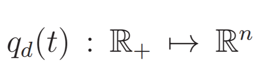
</p>

The error is defined as: 
<p align="center">
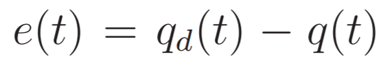
</p>
And the control law is defined as: 

<p align="center">
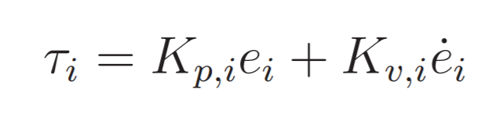
</p>
The Dynamic thus will be:
<p align="center">

</p>

In order to verify the stability at the desired value Direct Lyapunov is used with the following candidate:
<p align="center">

</p>
Deriving the equation we obtain the semi negative definite value:
<p align="center">
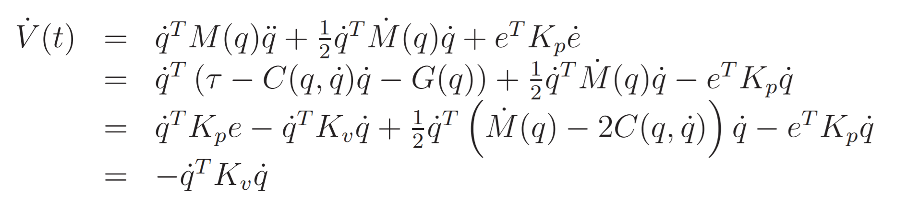
</p>
Also we must verify that:
<p align="center">

</p>

This implies that PD control the error converges to 0 if the following hypothesis are true:
<!-- 
 $$ G(qd) = 0 $$

 $$  q_d=H(t) \text{ (Heaviside Step function)}$$  -->


The first hypotesis will be analyzed in the simulation, while the second means that only step reference function can be given as input. This is ideal for pick and place.

I start with the following gains and then proceed to tune them for each specific controller:


<!-- $$ Kp = diag([30, 30, 30, 30, 30, 30, 30]) $$
$$ Kv = diag([1, 1, 1, 1, 1, 1, 1]) $$ -->

<!-- <p float="left">
  
   
  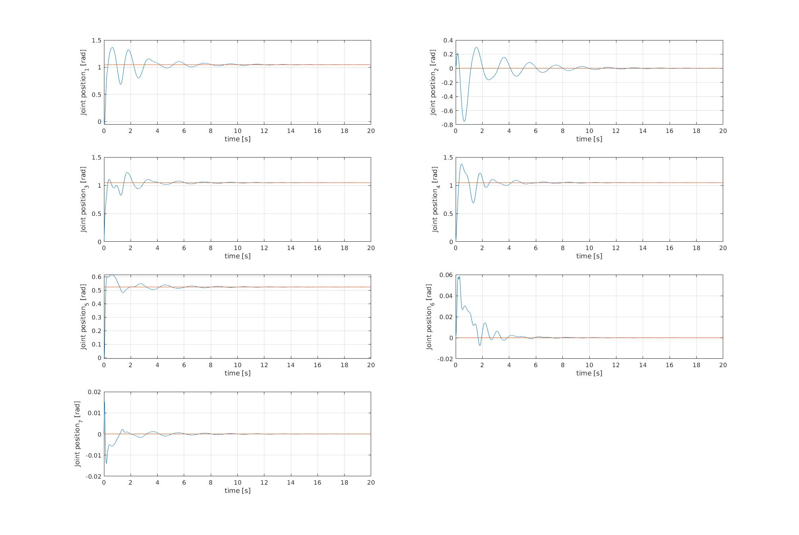
</p> -->

##### Case I: Robot gravity is ignored

If the remove the G term from the dynamic equation than both hypothesis are true and the error converges to 0.


<p align="center">

</p>

##### Case II: Robot gravity is no longer ignored

If we reinsert gravity one hypothesis is no longer true and we have an error offset in the solution:
<p align="center">

</p>


It is clear how gravity affects only some joints depending on the configuration of the robot.

##### Case III: Gravity Compensation

We can solve this by compensating the gravity term with the following law:

<!-- $$\tau = Kv*derr + Kp*err + G$$ -->
<p align="center">

</p>


### Independent PID controller


Proportional-Integral-Derivative (PID) controller has the optimum control
dynamics including zero steady state error, fast response (short rise time), no
oscillations and higher stability. The necessity of using a derivative gain
component in addition to the PI controller is to eliminate the overshoot and the
oscillations occurring in the output response of the system. 


<p align="center">

</p>

#### PID Without gravity compensation  

The initial offset slowly converges back to the right value (null steady state error). This PID doesn't require any knowledge of the gravity load for the manipulator.
 

 
It is worth mentioning that tuning the PID to achieve stability is much more difficult than tuning just the P and D components.


#### PID With gravity compensation 

We don't have anymore the big error offset on the second and sixth configuration variable. However it doesn't have the big advantage of the PID (zero knowledge about gravity load )

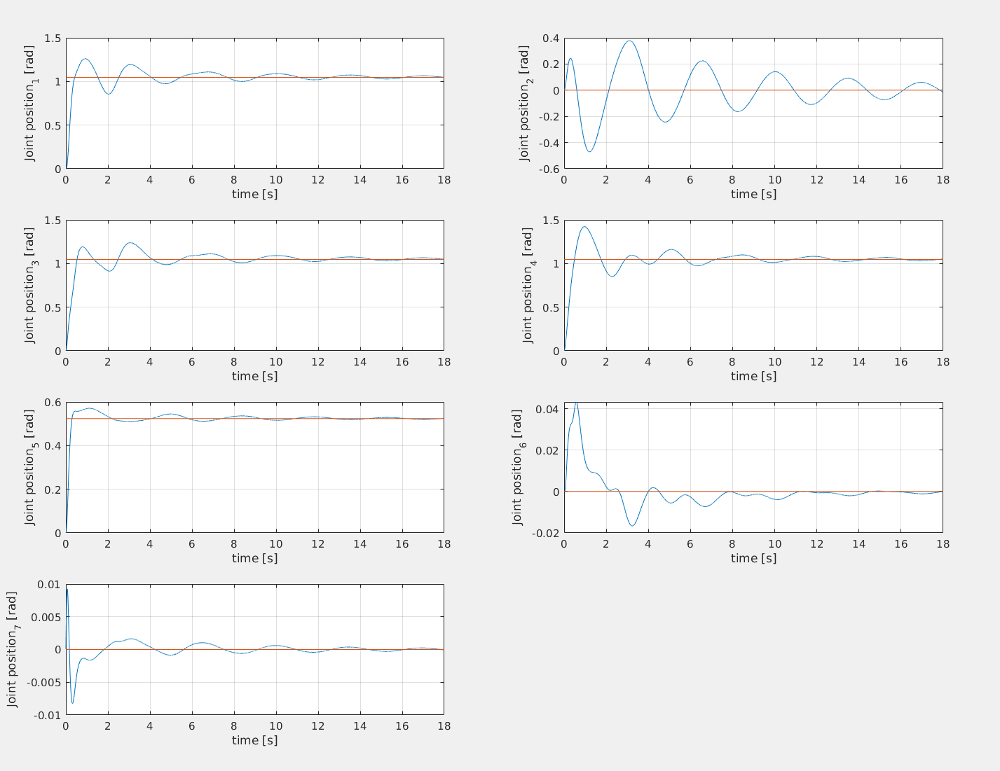


### Computed Torque


In order to achieve perfect reference tracking, the system should have an in built inner dynamical model that can be used to compute a feedforward action that complements the feedback action seen previously. A control that does this is the following:
<p align="center">

</p>

Substituting this in the dynamics we obtain:
<p align="center">
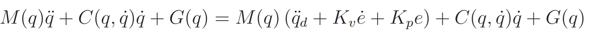
</p>
Which means that the error dynamics will be:
<p align="center">
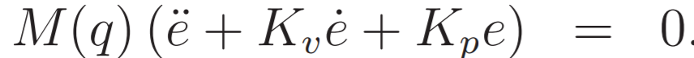
</p>
<p align="center">

</p>

Essentially, the perfect knowledge of the dynamical model allows for complete linearization and desired pole placement. The trajectory tracking can be solved with arbitrarly fast convergence.

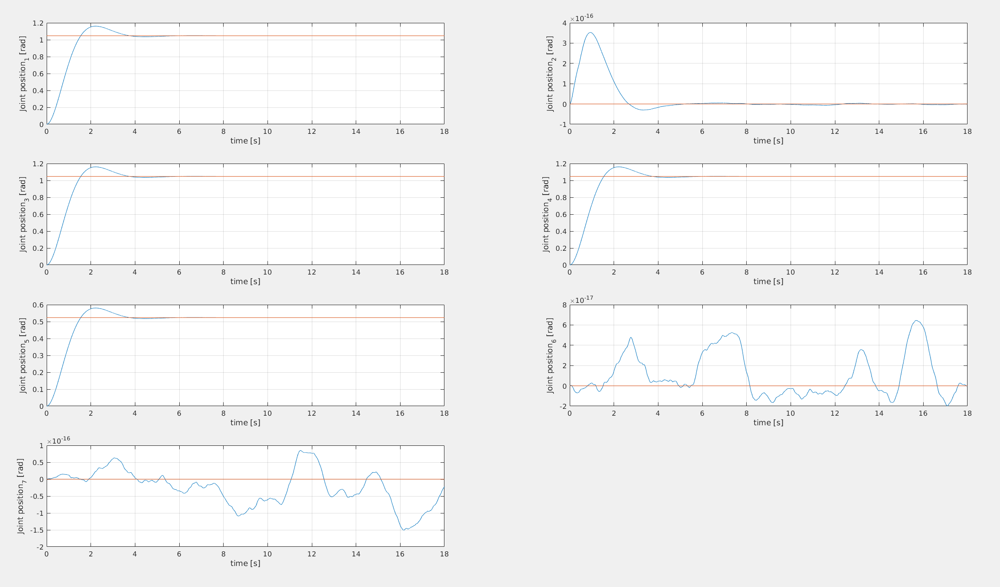


### Computed torque Robustness and errors in the dynamical model

When Noise in dynamical parameters knowledge or friction or other sources of error are introduced It is much more difficult to have stability guarantees for the Computed Torque controller. 
In the following results, it is clear how deeply even a random error $<5\%$ in the mass estimation affects the performances.


A more formal and correct approach would be to apply a control law with estimated M, G and C:
<!-- 
$$ \tau=\tilde M(q)\ddot{q_d}+K_v\dot{e}+Kp e+  \tilde C(q, \dot q)\dot q + \tilde G(q) $$ -->

Substituting the dynamics:

<!-- $$ \ddot e +Kv \dot e +Kp e = \eta $$

$$ \eta = \tilde M ^{-1}(\tilde M(q)\ddot{q_d}+  \tilde C(q, \dot q)\dot q + \tilde G(q)) $$ -->

Where $\eta$ depends non linearly from q.

### Pick and Place Results Overview

The image shows the PD, compensated PD, PID, Computed Torque, and reference signals for the pick and place task.

The integral component can compensate for some of the limits of the PD independent controller, however it was extremely difficult to achieve a good tuning.

The Computed Torque method allows desired pole placement and performances, however requires the exact dynamical model to linearize the dynamic.

The computer Torque method is only robust up to a certain error margin in the estimation of the dynamical parameters.


## Trajectory Tracking

Given a trajectory in the cartesian space, I compute the references in the joint space with the following block:

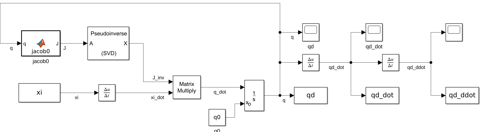

I use the non weighted pseudoinverse, therefore the solution will minimize the norm of the q.

Now I will proceed to define the used trajectories and the results for each controller.

- Trajectory tracking I: Circumference       
<p align="center">
  
</p> 
Trajectory Visualization
</p>   

<p align="center">
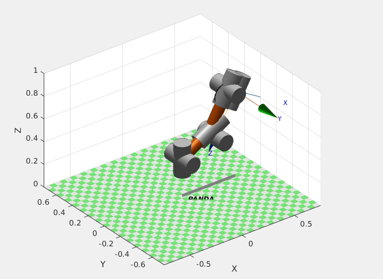
</p>  
Desired Joint Trajectories
</p> 
  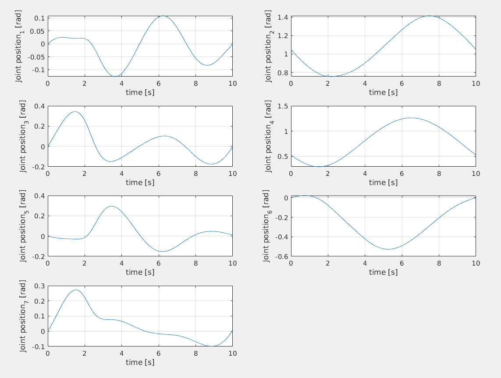
</p>   
Computed Torque Controller  
<p align="center">
  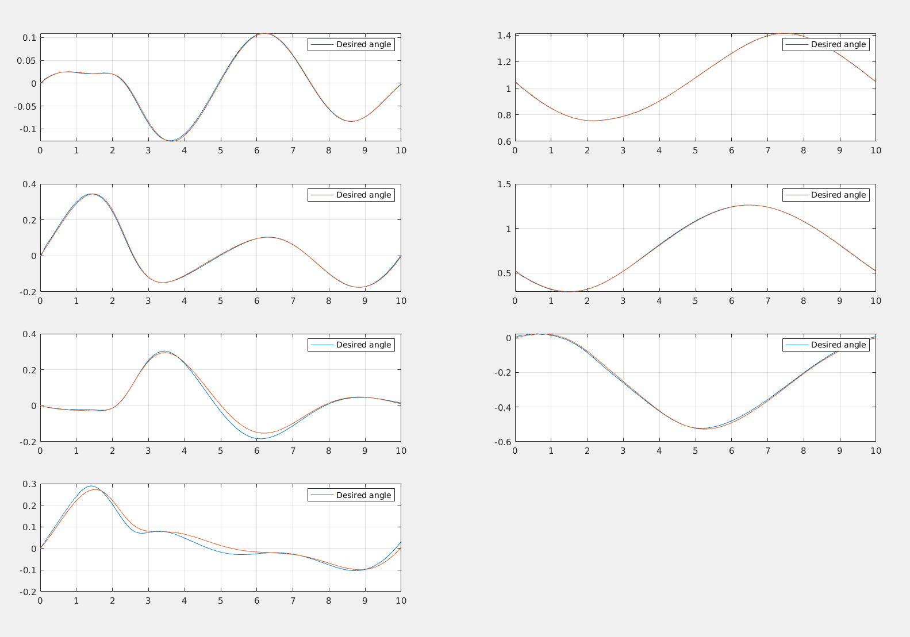
</p>   
Backstepping Controller
<p align="center">
  
</p>   
Performance comparison between CT and BS
<p align="center">
  
</p>   


 - Trajectory Trackin II: Helix        
  
<p align="center">
  
</p> 
Trajectory Visualization
</p>   

<p align="center">
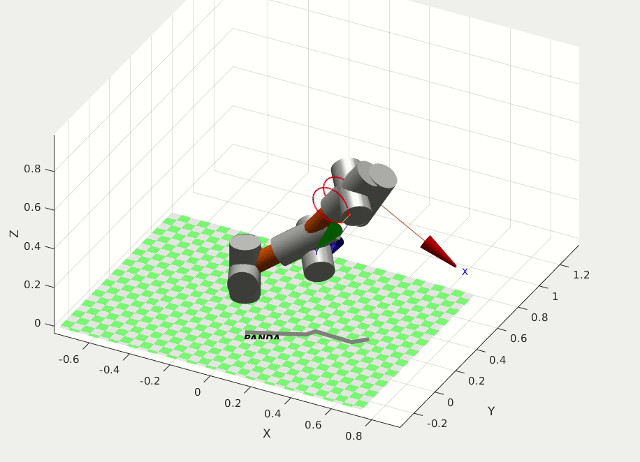
</p>  
Desired Joint Trajectories
</p> 
  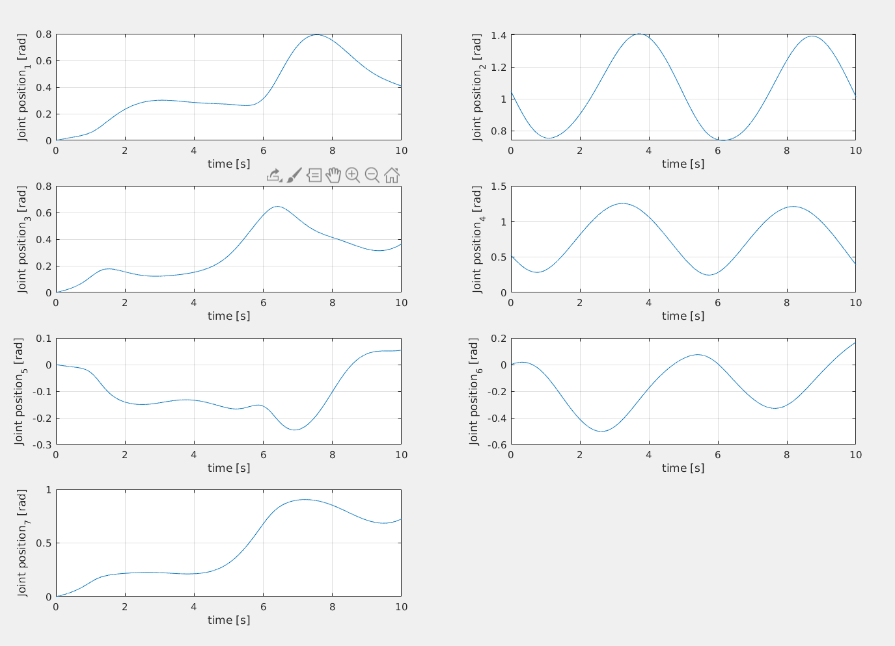
</p>   
Computed Torque Controller  
<p align="center">
  
</p>   
Backstepping Controller
<p align="center">
  
</p>   
Performance comparison between CT and BS
<p align="center">
  
</p>   
                                                                                       |
 <!-- --------------------------------------------------------------------------------------------------- |
                                           |
                                                        |
 Desired Helix Joint Trajectories          |
 Computed Torque Controller                |
 Backstepping Controller                   |
 Performance comparison between CT and BS  | -->


<!-- Given the following trajectories:

- Circumference with changing End Effector pose ($\theta$ function of time)

$$x = x_0 + r * cos(t*2*pi)      $$
$$y = y_0                     $$
$$z = z_0 + r * sin(t*2*pi)      $$
$$\theta = 0.1*sin(t/5*2*pi)                        $$
$$\phi = 0                             $$
$$\psi = 0                             $$


- Helix (With constant End Effector Orientation)


$$x = x_0 + r * cos(t*num*2*pi);         $$
$$y = y_0 + t*num*shift;                 $$
$$z = z_0 + r * sin(t*num*2*pi);         $$
$$\theta =  0;                           $$
$$\phi =    0;                           $$
$$\psi =    0;                           $$ -->


#### The Backstepping Control

Considering a system written in the form:


The backstepping controller assumes that a controller exists for the higher level system in the form of a stabilizing feedback law:


The control for the second variable is computed so that it tends to track u’. This is done 


For a completely actuated system the backstepping controller is reviewd in the follwing scheme:


#### Backstepping controller implementation

First, the necessary quantities are defined (reference velocity, tracking error).
Then, the torque is defined as:
<p align="center">

</p>


<p align="center">


</p>

<!-- The backstepping control can be used when system dynamics can be partitioned such that: 

<p align="center">
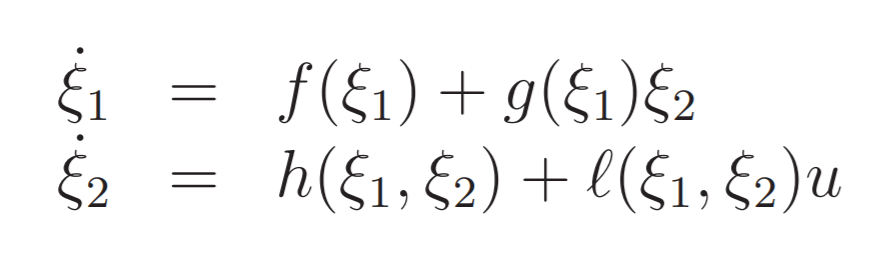
</p>


The backstepping method assumes that a controller design exist for the higher level system, which means that a feedback law exist for $\xi_2$ such that a Lyapunov function for $\xi_1$ is negative semi-definite.
<p align="center">

</p>
In the backstepping method the control is computed so that the state $\xi_2$ tends to track the value of u'. This can be optained using the Lyapunov function: 

<p align="center">

</p>

<p align="center">

</p>


<p align="center">

</p>

<p align="center">
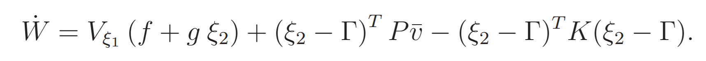
</p>

<p align="center">
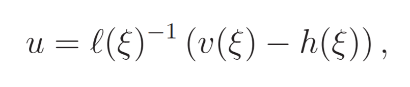
</p>

<p align="center">
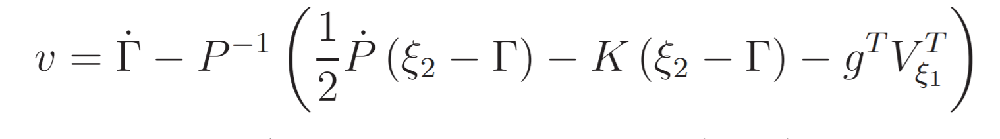
</p>
 -->


#### Response to different trajectories speed and amplitude


I will now investigate what happens if the speed of the reference trajectory is increased. The equation now is:

<!-- $$x = x_0 + r * cos(t*6*pi)      $$
$$y = y_0                     $$
$$z = z_0 + r * sin(t*6*pi)      $$
$$\theta = 0.1*sin(t/3*2*pi)                        $$
$$\phi = 0                             $$
$$\psi = 0                             $$ -->

Which correpsonds to the following joint trajectory:

<p align="center">


</p>

With the computed torque method, it is really simple to find a good set of paramteres to have really good controller performances:

Parameters for CT control:
<!-- $$ Kp = diag([3, 3 ,3 ,3 ,5 ,3 ,30]) $$
$$ Kv = 1/2 *diag([1 ,1 ,1 ,1 , 7 ,2 ,1]) $$ -->

</p>
Parameters for Backstepping:
<!-- $$Kp = 1* diag([1 ,1 ,1 ,1 ,3 ,1 ,1])$$ -->

<p align="center">
  |
</p>


The controllers provide very good performances despite of the speed of the reference trajectory.

## Perturbations of Dynamical parameters and Adaptive strategies

We have demonstrated that most of these controllers are based on a strong assumption, perfect knowledge. This is never the case. In the next example it is clear how just introducing a light friction in the robotic arm causes troubles for the computed torque controller: 


Usually, a perfect knowledge of the dynamical matrices is not known, and the controllers must rely on estimates.
In such a case, 

In the following section some dynamical parameters (the masses) are increased up to 2.5%.

```
for j = 1:num_of_joints % for each joint/link
    KUKAmodel.links(j).m = KUKAmodel.links(j).m .* (1+randi(5,1)/100); %masse [1x1]
end
```

Central to every adaptive controller is the Dynamic Regressor formulation that allows for a formulation that groups all the uncertainties in the estimation of the dynamic parameters.

### Dynamic Regressor

The dynamic regressor is a matrix function employed to write the dynamics linearly in the inertial parameters:


<p align="center">
<!--  -->

</p>


The Dynamic regressor an be computed in closed form from the Lagrangian formulation.
The lagrangian of a serial chain is defined as: 


<p align="center">
<!--  -->

</p>


The equations of motion will be:

<p align="center">
<!--  -->

</p>


Reformulating the dynamics with the regressor gives:

<p align="center">
<!--  -->

</p>


Rerranging the terms:

<p align="center">
<!--  -->

</p>


The regressor has been computed in Wolfram Mathematica 12, using the Screw Calclus Package. 
The computation of the regressor for the Kinova 7DOF manipulator revealed to be too expensive, therefore I proceeded to compute the regressor for a simplyfied version of the robot (removing the last two links). The computation for the 5 DOF arm infact was the limit in terms of the sheer size of the output that mathematica could handle.

From now on I will refer to this simplyfied model.


### New Trajectories for the adaptive control

- Trajectory I

THe first trajectory is not expected to be sufficiently rich (eg. to excite all the joints ) to be able to estimate all dynamical parameters correctly. (The first joint remains constant)
  
<p align="center">
<!--  -->

</p>

<p align="center">
<!--  -->

</p>

The second trajectory will excite all the joints. Further experiment must be conducted to understand if it is "sufficiently rich"

- Trajectory II
<p align="center">
<!--  -->

</p>

<p align="center">
<!--  -->

</p>


### Adaptive Computed Torque

If there is parameters uncertainties, the torque will be:

<p align="center">
<!--  -->

</p>

Where the dynamic matrices represented above are the estimates based on the uncertainties in the dynamical system.
Substituting the torque in the dynamics gives:

<p align="center">
<!--  -->

</p>


The estimated M  matrix is considered inverible.
As anticipated in the traditional computed torque section, the error dynamics is:

<p align="center">
<!--  -->

</p>


A proper dynamic of the dynamical estimation parameters must be chosen in order to grant the convergence to zero.
If we write the error dynamics in normal form:

<p align="center">
<!--  -->

</p>


and the Lyapunov Function will be:

<p align="center">
<!--  -->

</p>


The derivative of the Lyapunov function will be: 

<p align="center">
<!--  -->

</p>

and the dynamics of the parameters that makes it n.d is:

<p align="center">
<!--  -->

</p>

The convergence of the error dynamics is not guaranteed unless the Persistent Excitation condition is met:

<p align="center">
<!--  -->

</p>

In this case: 

<p align="center">
<!--  -->

</p>


The problems for this control are the invertibility of the estimated Mass matrix and the need for joint accelleration measurements.

#### Adaptive computed torque implementation:

<!--  -->

<p align="center">
<!--  -->

</p>

#### Adaptive computed torque results
<p align="center">
<!--  -->

</p>

<p align="center">
<!--  -->

</p>

This controller has a lot of margin for improvements by tuning the gains for both the error and the dynamic parameters dynamics.


#### Adaptive computed torque limits

The Adaptive computed torque method was the first adaptive method to be used on robotics manipulator. It is surely an important mileston but suffers some limits:
- The Estimated Mass matrix is not always invertible.

- It is usually very difficult to get clean acceleration measurements.

This problems will be solved in the Li-Slotine and Backstepping controllers.

### Li Slotine Controller

The Li Slotine control uses the reference velocity:

<p align="center">
<!--  -->

</p>

where:

<p align="center">
<!--  -->

</p>


The control torque is:

<p align="center">
<!--  -->

</p>


Deriving the Lyapunov Function:

<p align="center">
<!--  -->

</p>

and substituting the torque we have:

<p align="center">
<!--  -->

</p>

Choosing the following dynamics for the dynamical paremeters estimation:
<p align="center">
<!--  -->

</p>


A s.n.d derivative is obtained:
<p align="center">
<!--  -->

</p>


Using the Barbalat Lemma the asymptotic stability is achieved.

#### Li Slotine Implementation


#### Li Slotine Results


Dynamical parameters estimation is decent: for joints 3,4,5 the mass seems to converge to the right value, while for joints 1 and 2 it doesn't. This could depend from the trajectory which has not sufficient information to make the parameters estimation converges for each joint. The R matrix can surely be tuned more to achieve better estimation, but the simulation are computationally expensive so limited trials were made.


### Adaptive Backstepping Control


#### Adaptive Backstepping Implementation


#### Adaptive Backstepping Results


## Overview of the Results
 
All the results are stored in:

```
adaptive_backstepping.mat
adaptive_backstepping_dyn_pars.mat
computed_torque.mat
computed_torque_dyn_pars.mat
li-slotine.mat
li-slotine_dyn_pars.mat
```

We have shown how adaptive controllers are fundamentals for robust control of the robotics manipulator in the presence of uncertainties in the dynamical or friction parameters.
These are examples of how fast the computed torque performances degragadates in the presence of noise in the knowledge of the system parameters.

<p align="center">


</p>
The adaptive computed torque approach is based on complete linearization of the system but suffers some problems such as the need of acceleration estimation which is usually very noisy and the inverse of the Estimated Mass Matrix must be computed and it doesn't necessarly exists.

The Li Slotine and the Backstepping Adaptive Controller solve this issues, help to estimate the dynamical parameters and are able to control the system even with significative uncertainties.


In terms of performances all the adpative controllers provide very good tracking error if tuned properly. The dynamical estimation of the parameters is where they differ the most. The following comparison is provided:


<p align="center">


</p>


The adaptive computed torque has the fastest dynamics and is the most precise if tuned properly (In the figure joint 2 and 3 were not tuned properly)
The Backstepping controller is more precise than the Li-Slotine controller, with less oscillation and more steady behaviour. Both however have quite similar performances relative to the computed torque approach.


### Final remarks

Adaptive controllers computation required significantly more computational burden than non adpative simulations. 
This is a hint on how difficult it can be to robustly control manipulators in real time in the presence of uncertanties in the dynamical model. 

However, very good parameteric estimation can be made and Symbolic regressors can be built by performing experiments where the required quantities are measured (torques and control inputs). Doing an offline parametric identification can lead to the creation of an accurate model. The main limitation for such techniques is that accurate torque measurements are not always available. This is why the Kinova 7 DOF arm, with its force torque sensors at the joints, provides superior capabilities and allows for high performance control, and this is why it is being widely adopted in the industry.


