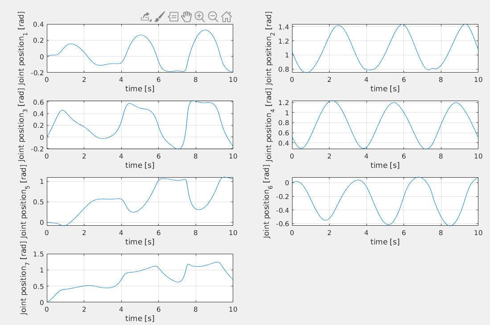
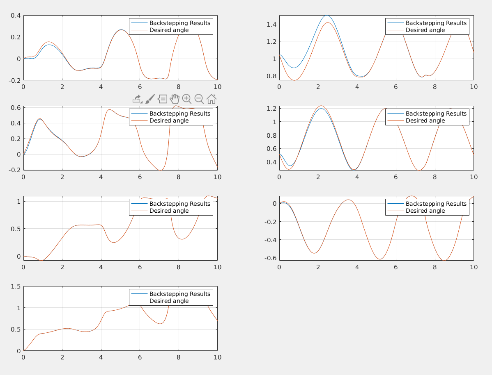

# The 7 DOF Franka Emika Panda robot


## Table of Content

- [The 7 DOF Franka Emika Panda robot](#the-7-dof-franka-emika-panda-robot)
  - [Table of Content](#table-of-content)
  - [Appendix A with results plot at full size](#appendix-a-with-results-plot-at-full-size)
  - [The robotic arm](#the-robotic-arm)
    - [Robot modelling](#robot-modelling)
    - [Overview of the Implemented Controllers](#overview-of-the-implemented-controllers)
      - [Non adaptive](#non-adaptive)
      - [Adaptive Methods](#adaptive-methods)
    - [Code Structure](#code-structure)
    - [Reference Trajectories](#reference-trajectories)
    - [Pick and Place](#pick-and-place)
      - [Trajectory definition](#trajectory-definition)
      - [Dynamic simulation](#dynamic-simulation)
      - [Independent PD controller](#independent-pd-controller)
        - [Case I: Robot gravity is ignored](#case-i-robot-gravity-is-ignored)
        - [Case II: Robot gravity is no longer ignored](#case-ii-robot-gravity-is-no-longer-ignored)
        - [Case III: Gravity Compensation](#case-iii-gravity-compensation)
    - [Independent PID controller](#independent-pid-controller)
    - [Computed Torque](#computed-torque)
    - [Computed torque Robustness and errors in the dynamical model](#computed-torque-robustness-and-errors-in-the-dynamical-model)
    - [Pick and Place Results Overview](#pick-and-place-results-overview)
  - [Trajectory Tracking](#trajectory-tracking)
      - [The Backstepping Control](#the-backstepping-control)
      - [Response to different trajectories speed and amplitude](#response-to-different-trajectories-speed-and-amplitude)
  - [Perturbations of Dynamical parameters and Adaptive strategies](#perturbations-of-dynamical-parameters-and-adaptive-strategies)
    - [Dynamic Regressor](#dynamic-regressor)
- [Appendix: Full scale Images for circumference Tracking](#appendix-full-scale-images-for-circumference-tracking)
    - [Circumference](#circumference)
      - [Computed Torque Controller](#computed-torque-controller)
      - [Backstepping Controller](#backstepping-controller)
      - [Controller Overview](#controller-overview)
    - [Helix](#helix)
      - [Desired Joint Trajectory:](#desired-joint-trajectory)
      - [Computed Torque controller](#computed-torque-controller-1)
      - [Backstepping Control](#backstepping-control)
      - [Backstepping vs Computed Torque](#backstepping-vs-computed-torque)


## Appendix A with results plot at full size

  - [Circumference](#circumference)
    - [Computed Torque Controller](#computed-torque-controller)
    - [Backstepping Controller](#backstepping-controller)
    - [Controller Overview](#controller-overview)
  - [Helix](#helix)
    - [Desired Joint Trajectory:](#desired-joint-trajectory)
    - [Computed Torque controller](#computed-torque-controller-1)
    - [Backstepping Control](#backstepping-control)
    - [Backstepping vs Computed Torque](#backstepping-vs-computed-torque)
 
## The robotic arm

This  7 DOF Franka Emika Panda robot is  equipped  with 7 revolute joints, each mounting a torque sensor, and it has a total weight of approximately 18kg, having the possibility to handle payloads up to 3kg.

  Figure 1 shows  the  Franka  Emika  Panda  robot, its geometrical parameters and the used DH convention.   

<p align="center">
  
</p>


### Robot modelling

The first step was to model the robot using Matlab Robot Control toolbox.

The robot is defined according to the DH table and its parameter are defined and assigned. This is done in 
```robot_gen.m```

The model is saved as ```PANDA```.

The following paramters are used: 
<!-- $$d1 = 0.333;d3=0.316;d5=0.384;a4=0.0825;a5=-0.0825;a7=0.088;$$
$$m1=3.4525; m2=3.4821; m3=4.0562; m4=3.4822; m5=2.1633; m6=2.3466; m7=0.31290;$$ -->


The parameters are found in  [this online repository](https://github.com/marcocognetti/FrankaEmikaPandaDynModel.git) while the exact procedure is described here:

[Dynamic Identification of the Franka Emika Panda Robot with Retrieval of Feasible Parameter Using Penalty-based Optimization](https://hal.inria.fr/hal-02265293/document)

The resulting model is: 

<!-- <p align="center">

</p>

Following the Denavit-Hartenberg convention: -->

<!-- $$ L1 = Link([0,d1,  0,  0]), $$
$$ L2 = Link([0,0, 0,  -pi/2])   $$
$$ L3 = Link([0,d3, 0,  pi/2])   $$
$$ L4 = Link([0,0,  a4,  pi/2])   $$
$$ L5 = Link([0,d5,  a5,  -pi/2])   $$
$$ L6 = Link([0,0,  0,  pi/2])   $$
$$ L7 = Link([0,0,  a7,  pi/2])   $$ -->


<p align="center">
  <!--  -->
  
  
</p>


Once we have the dynamical model properly set up, we can proceed to implement the controllers.

### Overview of the Implemented Controllers


#### Non adaptive


|                              | Pick and Place     | Circumference      | Helix              |
| ---------------------------- | ------------------ | ------------------ | ------------------ |
| PD                           | :heavy_check_mark: | :x:                | :x:                |
| PD with gravity compensation | :heavy_check_mark: | :x:                | :x:                |
| PID                          | :heavy_check_mark: | :x:                | :x:                |
| Computed torque              | :heavy_check_mark: | :heavy_check_mark: | :heavy_check_mark: |
| Backstepping                 | :x:                | :heavy_check_mark: | :heavy_check_mark: |

####  Adaptive Methods 

|                          | Pick and Place     | Circumference      | Helix              |
| ------------------------ | ------------------ | ------------------ | ------------------ |
| Adaptive Computed Torque | :heavy_check_mark: | :heavy_check_mark: | :heavy_check_mark: |
| Adaptive Backstepping    | :x:                | :heavy_check_mark: | :heavy_check_mark: |
| Li Slotine               |:x: | :heavy_check_mark: |  :heavy_check_mark: |


### Code Structure

Before I dive into the report, I would line to outline the code structure. In the repository, there are essentially three folders. 
- Pick and place: It contains every result for the pick and place simulation. Every controller will be found in 
```
./pick_and_place_results/pickandplace_ (desired controller).m
```
like: 
```
./pick_and_place_results/pickandplace_computedtorque.m
```
Most of the results are already stored as (desired controller)_results.mat

Comparative plots for the pick and place scenario can be found in 

```
./pick_and_place_results/plot_results.m
```

- Non adaptive control


- Adaptive control

### Reference Trajectories

I defined three reference trajectories:

|   Pick and Place	|   Circumference	|   Helix	|
|---	|---	|---	|
|   	|   	|   	|

Each trajectory will now be discussed in details with the implemented controllers.

### Pick and Place

#### Trajectory definition

Initial Conditions


<!-- $$ q_{ini} = [0, 0, 0, 0, 0, 0, 0] $$ -->

Final Conditions


<!-- $$ q_{des} = [pi/3, 0, pi/3, pi/3, pi/6, 0 , 0]$$ -->


#### Dynamic simulation

Starting from the initial conditions I compute the following quantities in a for loop over a 10s period with time constant 1ms :

- Error, derivate of the error, integral of the error

<!-- $$ err = q_{des} - q $$
$$ \frac {\partial err}{\partial t} = \frac {\partial (q_{des}-q)}{\partial t}  $$
$$ \Delta ierr=(err+err_{old})*\delta_{t/2} $$ -->

- Dynamic matrices

<!-- $$ F = \text{FrictionTorque}(dq) $$ 
$$ G = \text{GravityVector(q)} $$
$$ C = \text{CoriolisVector(q,dq)} $$
$$ M = \text{MassMatrix(q)} $$ -->


- Torque, depending on the controller (PD, PD with G compensation, PID)
 
<!-- $$\tau = ( Kv*(derr') + Kp*(err'))'; $$


<!-- $$ \text{PD Controller with G compensation}$$ -->
<!-- $$ \tau = ( Kv*(derr') + Kp*(err') + G' $$ -->

<!-- $$\text{PID Controller }$$ -->
<!-- $$ \tau = ( Kv*(derr') + Kp*(err')+ Ki*(ierr') + G'$$  --> 


And last, accelleration, velocity and displacement resulting from the compute torque applied for a delta t of 1ms.


<!-- $$\ddot q = M^{-1}*(\tau - C- G)$$ -->

Tustin integration:


<!-- $$\Delta \dot q = (\ddot q_{old} + \ddot q) * \delta_{t} / 2$$

$$\Delta q = (\dot q_{old}+\dot q   ) * \delta_{t} /2$$ -->


#### Independent PD controller

The first and most simple solution to control the end effector to a desired pose is to apply standard independent PD controller to follow references. 

The aim of using Proportional-Derivative (PD) controller is to increase the stability of the system by improving control since it has an ability to predict the future error of the system response. In order to avoid effects of the sudden change in the value of the error signal, the derivative is taken from the output
response of the system variable instead of the error signal. Therefore, D mode is
designed to be proportional to the change of the output variable to prevent the
sudden changes occurring in the control output resulting from sudden changes in the error signal. 

<p align="center">

</p>

The error is defined as: 
<p align="center">

</p>
And the control law is defined as: 

<p align="center">

</p>
The Dynamic thus will be:
<p align="center">

</p>

In order to verify the stability at the desired value Direct Lyapunov is used with the following candidate:
<p align="center">

</p>
Deriving the equation we obtain the semi negative definite value:
<p align="center">

</p>
Also we must verify that:
<p align="center">

</p>

This implies that PD control the error converges to 0 if the following hypothesis are true:
<!-- 
 $$ G(qd) = 0 $$

 $$  q_d=H(t) \text{ (Heaviside Step function)}$$  -->


The first hypotesis will be analyzed in the simulation, while the second means that only step reference function can be given as input. This is ideal for pick and place.

I start with the following gains and then proceed to tune them for each specific controller:


<!-- $$ Kp = diag([30, 30, 30, 30, 30, 30, 30]) $$
$$ Kv = diag([1, 1, 1, 1, 1, 1, 1]) $$ -->

<!-- <p float="left">
  
   
  
</p> -->

##### Case I: Robot gravity is ignored

If the remove the G term from the dynamic equation than both hypothesis are true and the error converges to 0.


<p align="center">

</p>

##### Case II: Robot gravity is no longer ignored

If we reinsert gravity one hypothesis is no longer true and we have an error offset in the solution:
<p align="center">

</p>


It is clear how gravity affects only some joints depending on the configuration of the robot.

##### Case III: Gravity Compensation

We can solve this by compensating the gravity term with the following law:

<!-- $$\tau = Kv*derr + Kp*err + G$$ -->
<p align="center">

</p>


### Independent PID controller


Proportional-Integral-Derivative (PID) controller has the optimum control
dynamics including zero steady state error, fast response (short rise time), no
oscillations and higher stability. The necessity of using a derivative gain
component in addition to the PI controller is to eliminate the overshoot and the
oscillations occurring in the output response of the system. 


<p align="center">

</p>

| PID Without gravity compensation  | PID With gravity compensation  |
|---|---|
|The initial offset slowly converges back to the right value (null steady state error). This PID doesn't require any knowledge of the gravity load for the manipulator.| We don't have anymore the big error offset on the second and sixth configuration variable. However it doesn't have the big advantage of the PID (zero knowledge about gravity load ) |
|   |   |

 
It is worth mentioning that tuning the PID to achieve stability is much more difficult than tuning just the P and D components.

### Computed Torque
<p align="center">

</p>


In order to achieve perfect reference tracking, the system should have an in built inner dynamical model that can be used to compute a feedforward action that complements the feedback action seen previously. A control that does this is the following:
<p align="center">

</p>

Substituting this in the dynamics we obtain:
<p align="center">

</p>
Which means that the error dynamics will be:
<p align="center">

</p>
<p align="center">

</p>

Essentially, the perfect knowledge of the dynamical model allows for complete linearization and desired pole placement. The trajectory tracking can be solved with arbitrarly fast convergence.


### Computed torque Robustness and errors in the dynamical model

When Noise in dynamical parameters knowledge or friction or other sources of error are introduced It is much more difficult to have stability guarantees for the Computed Torque controller. 
In the following results, it is clear how deeply even a random error $<5\%$ in the mass estimation affects the performances.


A more formal and correct approach would be to apply a control law with estimated M, G and C:
<!-- 
$$ \tau=\tilde M(q)\ddot{q_d}+K_v\dot{e}+Kp e+  \tilde C(q, \dot q)\dot q + \tilde G(q) $$ -->

Substituting the dynamics:

<!-- $$ \ddot e +Kv \dot e +Kp e = \eta $$

$$ \eta = \tilde M ^{-1}(\tilde M(q)\ddot{q_d}+  \tilde C(q, \dot q)\dot q + \tilde G(q)) $$ -->

Where $\eta$ depents non linearly from q.

### Pick and Place Results Overview

The PD surely is the easiest control, but suffers severe limits in terms of both hypotesis and performances. Gravity needs to be compensated to allow it converges to the desired value.

The integral component can compensate for some of the limits of the PD independent controller, however it was extremely difficult to achieve a good tuning.

The Computed Torque method allows desired pole placement and performances, however requires the exact dynamical model to linearize the dynamic.

The computer Torque method is only robust up to a certain error margin in the estimation of the dynamical parameters.


## Trajectory Tracking

Given a trajectory in the cartesian space, I compute the references in the joint space with the following block:


I use the non weighted pseudoinverse, therefore the solution will minimize the norm of the q.

Now I will proceed to define the used trajectories and the results for each controller.

| Circumference  | Helix  |
|---|---|
|   |   |
|   |      |
| Desired Circumference Joint Trajectories   |  Desired Helix Joint Trajectories  |
|Computed Torque Controller     | Computed Torque Controller    |
| Backstepping Controller   |  Backstepping Controller  |
|  Performance comparison between CT and BS   |  Performance comparison between CT and BS   |


<!-- Given the following trajectories:

- Circumference with changing End Effector pose ($\theta$ function of time)

$$x = x_0 + r * cos(t*2*pi)      $$
$$y = y_0                     $$
$$z = z_0 + r * sin(t*2*pi)      $$
$$\theta = 0.1*sin(t/5*2*pi)                        $$
$$\phi = 0                             $$
$$\psi = 0                             $$


- Helix (With constant End Effector Orientation)


$$x = x_0 + r * cos(t*num*2*pi);         $$
$$y = y_0 + t*num*shift;                 $$
$$z = z_0 + r * sin(t*num*2*pi);         $$
$$\theta =  0;                           $$
$$\phi =    0;                           $$
$$\psi =    0;                           $$ -->


#### The Backstepping Control

The backstepping control can be used when system dynamics can be partitioned such that: 

<p align="center">

</p>


The purpose of the backstepping controller is to assume that a controller design exist for the higher level system, which means that a feedback law exist for $\xi_2$ such that a Lyapunov function for $\xi_1$ is negative semi-definite.
<p align="center">

</p>

<p align="center">

</p>

<p align="center">

</p>


<p align="center">

</p>

<p align="center">

</p>

<p align="center">

</p>

<p align="center">

</p>


#### Response to different trajectories speed and amplitude


I will now investigate what happens if the speed of the reference trajectory is increased. The equation now is:

<!-- $$x = x_0 + r * cos(t*6*pi)      $$
$$y = y_0                     $$
$$z = z_0 + r * sin(t*6*pi)      $$
$$\theta = 0.1*sin(t/3*2*pi)                        $$
$$\phi = 0                             $$
$$\psi = 0                             $$ -->

Which correpsonds to the following joint trajectory:

<p align="center">


</p>

With the computed torque method, it is really simple to find a good set of paramteres to have really good controller performances:

Parameters for CT control:
<!-- $$ Kp = diag([3, 3 ,3 ,3 ,5 ,3 ,30]) $$
$$ Kv = 1/2 *diag([1 ,1 ,1 ,1 , 7 ,2 ,1]) $$ -->

Parameters for Backstepping:
<!-- $$Kp = 1* diag([1 ,1 ,1 ,1 ,3 ,1 ,1])$$ -->

| CT results  |  Backstepping results |
|---|---|
|   |   |


The controllers provide very good performances despite of the speed of the reference trajectory.

## Perturbations of Dynamical parameters and Adaptive strategies

What happens if dynamical parameters estimation is biased? 

```
for j = 1:num_of_joints % for each joint/link
    PANDAmodel.links(j).m = PANDAmodel.links(j).m .* (1+randi(5,1)/100); %masse [1x1]
end
```

In the following section dynamical parameters are randomly increased up to 5%.

### Dynamic Regressor

The regressor has been computed in Wolfram Mathematica 12, using the Screw Calclus Package. 
The computation of the regressor for the Kinova 7DOF manipulator revealed to be too expensive, therefore I proceeded to compute the regressor for a simplyfied version of the robot (removing the last two links). The computation for the 5 DOF arm infact was the limit in terms of the sheer size of the output that mathematica could handle.

From now on I will refer to this simplyfied model.


 
  
   


       


# Appendix: Full scale Images for circumference Tracking


### Circumference 


Desired joint trajectories:


#### Computed Torque Controller


#### Backstepping Controller

In order to implement the backstepping controller I have to define some other quantities.

$$\tau = M*ddqr + C*dqr + F + G + Kp*s + err $$


#### Controller Overview


### Helix 


#### Desired Joint Trajectory:


#### Computed Torque controller

The controller applies the following torque:


$$\tau = ( M*(ddq_{des} + Kv*derr + Kp*err) + C*dq + F + G )$$


After some gains tuning the following tracking is achieved. The tracking is almost perfect but again, the computed torque method requires complete knowledge of the dynamical system. It is much more interesting to understand what happens when there are dynamical parameters uncertainties.


#### Backstepping Control


#### Backstepping vs Computed Torque

