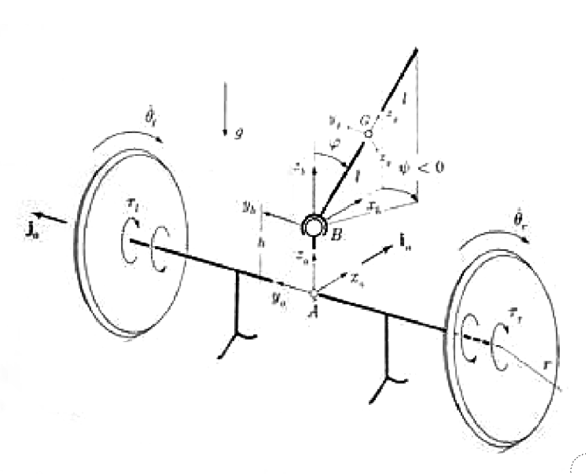
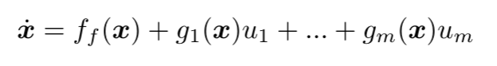
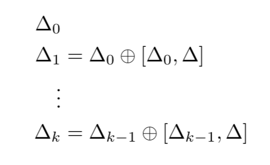
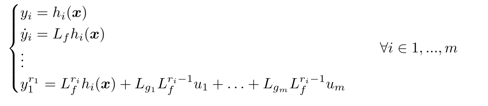
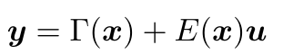
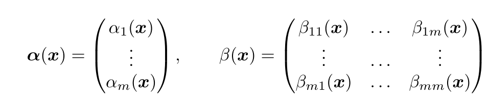
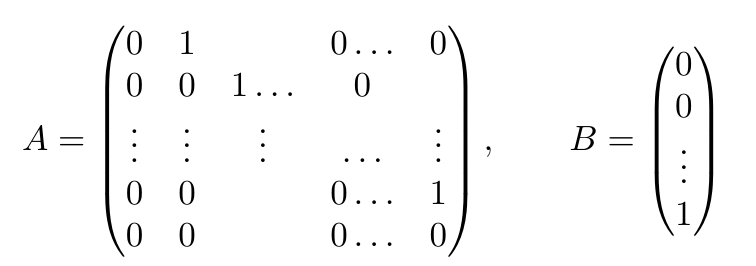

# Robots Control Project: Tavola 2 e 3

## Table of Content

- [Robots Control Project: Tavola 2 e 3](#robots-control-project-tavola-2-e-3)
  - [Table of Content](#table-of-content)
  - [Introduction](#introduction)
  - [Inverse spherical anolonome pendulum](#inverse-spherical-anolonome-pendulum)
    - [Non Minimal state representation](#non-minimal-state-representation)
    - [Minimal State representation](#minimal-state-representation)
    - [No slip condition and Non holonomic constraints](#no-slip-condition-and-non-holonomic-constraints)
    - [Parameters](#parameters)
    - [Direct Kinematics](#direct-kinematics)
    - [Kinetic Energy](#kinetic-energy)
    - [Potential Energy and Lagrangian](#potential-energy-and-lagrangian)
    - [Dynamics model and Equations of Motion](#dynamics-model-and-equations-of-motion)
    - [System Dynamics with redundant state representation](#system-dynamics-with-redundant-state-representation)
    - [System Dynamics with minimal state representation](#system-dynamics-with-minimal-state-representation)
    - [Free motion simulation](#free-motion-simulation)
    - [Normal Form](#normal-form)
    - [Controllability and Accessibility](#controllability-and-accessibility)
    - [Osservability](#osservability)
    - [Feedback Linearization in MIMO systems](#feedback-linearization-in-mimo-systems)
    - [Comparison with Optimal Control](#comparison-with-optimal-control)

  <!--  -->
  
    <figcaption  align="Center"> Fig.1 - Anolonome Spherical Inverted pendulum.</figcaption>

## Introduction

The problem of balancing an inverted pendulum has attracted the attention of control researchers in recent decades. There exist a wide variety of inverted-pendulum-type systems, such as the pendubot, the acrobot, the pendulum on a cart, the inertial wheel pendulum and the Furuta pendulum. All these systems are under-actuated, that is, they are systems with fewer actuators than degrees of freedom.

This work deals with the modelling and control of a spherical inverted pendulum (SIP), which is another member of the family of inverted pendulum systems with degree of under-actuation of two.

The system consists of a rigid rod coupled in its base to an under-actuated universal joint in such a way that the extreme of the rod moves over a spherical surface with its centre at the base of the rod (see Figure 1). As such, through the motion of the base of the pendulum on the horizontal plane it is possible to balance the extreme of the rod in its upright position.

## Inverse spherical anolonome pendulum

The Spherical anolonome inverted pendulum is a underactuated system with $4 \ dof$. 
- Two rotations are needed to describe the pose of the pendulum on a spherical surface (the third angle is not necessary as it is an symmetry axes for the pendulum) 
- Two coordinates are needed for the bases of the pendulum (eg. the angles of the two wheels).

There are multiple ways to parametrize the state, but the main choiche is wether to choose a minimal or a non minimal state representation.

### Non Minimal state representation

In this case the state would be:

$$q(t)=\{\theta_r,\theta_l,\psi,\phi,x,y,\theta\}$$

In this case it would be easier to compute the direct kinematic as many quantities would be related directly to $x$ and $y$.

If a system is parametrized with m $m$ coordinates but only has $n(n<m)$ dof; then, there should exist $p=m−n$ constraints which allow the reduction of the order of the system from m to n; in others words, if we choose n independent joint variables there must exist p dependent joint variables.

Let $ρ=[q(t),β(t)] \in R_m$ be the vector of generalized joint variables ( $\ q\ ∊\ ℝ_n$ be the vector of independent variables and $β ∊ ℝ_p$ be the vector of dependent, or constrained, variables). The holonomic constraints can then be grouped in a vector of the form.

$$γ(ρ)=0∈R_p$$

so that, as a result, it should be possible to express β as a function of q, i.e.,

$$β=β(q)$$

### Minimal State representation

The second possibility is to represent the state with a minimal representation. In this case the configuration would be:

I choose the following independent variables: 

$$\theta_r(t):\text{left wheel}                                 $$
$$\theta_{l}(t): \text{right wheel}                             $$
$$\psi (t): \text{X rotation in the XYZ parametrization}        $$
$$\phi (t): \text{Y rotation in the XYZ parametrization}        $$

So that the resulting minimal representation is:

$$q(t)=\left\{\theta_r(t),\theta_l(t),\psi (t),\phi (t)\right\}$$

$$\dot q(t)=\{\dot{\theta_r}(t),\dot{\theta}_{l}(t),\dot{\psi}(t),\dot{\phi}(t)\}$$

### No slip condition and Non holonomic constraints

 Without explicitly modelling the constraints, I can choose a set of independent variables with the embedded constraints (rolling without slipping for the two wheels in my case). This results in $x,y$ and $\theta$ being excluded from the state and only related to $\theta_r, \theta_l$ with the following relationship:

$$\theta =\frac{r (\theta_r(t)-   \theta_l(t)}{l_{a}}$$

$$\dot x=\frac{r \cos (\theta ) (\dot     {\theta} r(t)-\dot{\theta}l(t))}{2} $$

$$\dot y=\frac{r \sin (\theta ) (\dot     {\theta} r(t)-\dot{\theta}l(t))}{2} $$

### Parameters

Just for reference, the used parameters:

$$G\to 9.81,m_p\to 1      ,m_a\to 1      ,m_r\to 0.5    ,l_p\to 0.7    ,l_a\to 1      ,r\to 0.3            ,I_a\to 0.8$$

### Direct Kinematics

The direct kinematics problem consists in finding expressions for the pose (i.e., position and orientation) variables of an element of interest of the system, described by the vector x in terms of the actuated joint variables; this can be expressed as

$$x=f(q,β(q))$$
	

In addition, by taking the time derivative of the previous equation we get the so-called differential kinematics equation

$$\dot x=J(ρ)\dot q$$

where 
$$J(ρ)=∂f(q,β(q))∂q$$

On the other hand, the inverse kinematics problem consists in establishing the value of the actuated joint coordinates that correspond to a given pose of the element of interest, and can be expressed as

$$q=f^{-1}(x)$$
	

The inverse kinematics problem can be solved in general form by geometric or analytic approaches.

The following quantities need to be defined to compute the terms necessary for the lagrangian formulation of the equations of motion:
- $O$ center of the wheels axis $\{$ $x,y,0\}$ 
- $OP$ center of mass of the pendulum
- $v_{rl}$: velocity of the center of mass of the left wheel
- $v_{rr}$: velocity of the center of mass of the right wheel
- $v_{p}$: velocity of the center of mass of the pendulum
- $v_a$: velocity of the wheel axis
- $\omega P_{g}$: angular velocity of pendulum in fixed frame
- $\omega P_{p}$: angular velocity of pendulum in pendulum frame
- $x$: velocity of the center of mass of the left wheel
- $y$: velocity of the center of mass of the left wheel
- $\theta$: velocity of the center of mass of the left wheel
 
The velocity of the wheels are easy to obtain from state coordinates through the no slip condition:

$$ v_a=\{ \dot x, \dot y, 0\}^T$$

 $$v_{rl}=r  \dot{\theta}_l(t);$$

$$v_{rr} =r \dot{\theta}_r(t) ;$$
 

$$R_p=R_x(\psi (t)).R_y(\phi (t)).R_z(\eta (t));$$

$$\omega P_g=\dot \eta (t) R_x(\psi (t)) R_y(\phi (t)) \times \{0,0,1\}+\dot \phi (t) R_x(\psi (t))\times \{0,1,0\}+\{1,0,0\} \dot \psi (t);$$

$$\omega P_s=\dot \psi (t) (R_y}(\phi (t)).R_z(\eta (t)))^T {1,0,0\}+\dot \phi (t) Rz}(\eta (t))^T.\{0,1,0\}+\{0,0,1\} \eta '(t)$$

$$ v_p = v_a + \omega P_g \times AP$$

### Kinetic Energy

$$E_{tot}=E_{p2}+E_{a1}+E_{a2}+E_{wl1}+E_{wr1}+E_{wl2}+E_{wr2} $$
$$E_{p1}=\frac{m_p  v_P^T v_P}{2}$$
$$E_{a2}=\frac{I_{a} \theta^2  }{2} $$
$$E_{p2}=\frac{1}{2}   \omega P_s J_{pg} \omega P_s$$
$$E_{a1}=\frac {m_{p}  v_{a}   v_{a}}{2}$$
$$E_{wl2}=\frac{w_{rr}J_{r}    w_{rr}}{2}$$
$$E_{wr2}=\frac{w_{rl} J_{r}   w_{rl}}{2}$$
$$E_{wl1}=\frac{m_{r}  v_{rr}^2}{2}; $$
$$E_{wr1}=\frac{m_{r}  v_{rl}^2}{2}$$

### Potential Energy and Lagrangian

$$ mpgz_p $$

$$ L=E_{tot}-U $$

### Dynamics model and Equations of Motion

As mentioned in [20], the dynamics model of SIP using either the Newton-Euler or the Euler-Lagrange methodology is traditionally obtained by cutting the closed loops to obtain systems with open chains and/or tree-type structures, so that it is possible to write a set of ODE s for such chains in their corresponding generalized coordinates. The solution to these equations requires satisfying additional algebraic equations guaranteeing the closure of the cut-open loops. To this end, some Lagrange multipliers (which physically represent the forces due to the constraints) are employed. The resulting formulation, often referred to as a descriptor form, yields a system of DAEs which, in general, cannot be solved employing conventional ODE techniques.

$$ \frac{\partial }{\partial t}\frac{\partial L}{\partial \text{qd}(t)}-\frac{\partial L}{\partial q(t)}=\tau_q$$

$$\tau_q=\{0, 0,0,0,\tau_r, \tau_l,0 ,0\}^T$$ 

### System Dynamics with redundant state representation

If the chosen state representation is redundant ( $n$ of variables $>$ $dof$ ) the coordinates will be related by some constraints.

The constraint can be expressed in the Pfaffian form:
$$A(q) \dot q = 0$$
<!-- $$A(q) =\begin{pmatrix}
        1 &0 &-r \sin(\phi_1 + \phi_2) &-r \sin(\phi_1 + \phi_2) & \cos(\phi_1 + \phi_2)\\
        0 &1  & r \cos(\phi_1 + \phi_2) & r \cos(\phi_1 + \phi_2) &\sin(\phi_1 + \phi_2)
    \end{pmatrix} \in \mathbb{R}^d$$ -->
And the equations then become:
$$\begin{cases}
    M(q)\ddot q + C(q, \dot q) \dot q + G(q) + A^{T}(q)\lambda = b_m \tau \\
    A(q) \dot q = 0
\end{cases}
$$
where $\bm \tau = (0,\,0,\,0, 0,\tau_{r},\tau_{l},0,0)^T$ and the lagrangian multiplier $\lambda$ represents the vincular forces that act on the system.
Using the pseudo-velocity method the equations can be rewritten starting from the consideration that the velocities $\dot q$ must belong to the null space of $A(q)$. We thus define $S(q)$, a basis for the Null Space of $A(q)$. The following relationship holds:
$$ \dot q = S(q) b_m \nu $$
where $\bm \nu \in \mathbb{R}^{n-d}$ is the pseudo-velocity vector useful to represent .

Deriving the equation:
$$ \ddot q = S(q) \dot{b_m \nu} + \dot{S}(q) b_m \nu$$ 
Substituting in the dynamics equations and pre multipyling for $S(q)^T$ the equations can be rewritten as:
$$  \dot q = S(q) b_m \nu$$
$$  \dot{\bm \nu} = - \overline{M}(q)^{-1} \overline{h}(q, b_m \nu) + \overline{M}(q)^{-1} S(q)^T b_m \tau 
$$
where:
$$\overline{M}(q) = S^T M S $$
$$\overline{h}(q, \bm \nu) = S^T(C S \bm \nu + G + M \dot{S} \bm \nu)$$ 

### System Dynamics with minimal state representation

### Free motion simulation

The best way to understand if the equation of motion found are correct is to simulate with an ODE solver the equations of motion from different starting conditions and verify if the system behaves in a physically plausible way. 
In this case I tried to simulate the system starting near the upright position, and the result is the following:

### Normal Form

### Controllability and Accessibility

The controllability of the non linear system can be analyzed starting from the Chow's theorem, that states: A system is small time locally accessile in $x_0 \in \mathbb{R} ^n$ if, given the system 

and the distributions: 

the smallest $\Delta$-invariant containing+ $\Delta_0$, which is $< \Delta | \Delta_0>$, has dimensions $n$ in $x_0$.
The dimensions of  $< \Delta | \Delta_0>$ can be computed using the filtration procedure, for which the following quantity must be computed iteratively:

dove $[\Delta_i, \Delta]$ rappresenta la Lie-bracket tra i campi vettoriali delle due distribuzioni. La procedura viene fermata quando $i=n$ o quando si trova un valore $k$ tale per cui le distribuzioni $\Delta_k$ e $\Delta_{k+1}$ sono non-singolari nel punto di interesse $x_0$ e $\dim \Delta_k(x_0) = \dim \Delta_{k+1}(x_0)$.
Dalla procedura di filtrazione applicata al sistema in esame si ottiene che la massima dimensione di $\Delta_k$ è 5, per cui il sistema in fase di volo non è \textit{small-time locally accessible}, e quindi neanche controllabile, per nessun valore di $x_0$. Questo risultato coincide con quanto ci si può intuitivamente aspettare, in quanto il sistema è in caduta libera e non si ha la possibilità di applicare forze esterne per controllarne la posizione).\\
Si nota inoltre che questo valore rappresenta la dimensione massima data dalla procedura di filtrazione, in quanto essa è stata effettuata simbolicamente e sostituendo valori specifici di un punto $x_0$ all'interno della distribuzione si può avere un'ulteriore perdita di rank.

### Osservability

To study the observability of a system there are three different approaches. In this case Iwill use the geometric differentiable approach. Analoug to the controllability case, a filtration procedure between the co-distribution $\Omega_0 = \frac{\partial h(x)}{\partial x}$ and the distribution $\Delta = span\{f(x), g_1(x),...,g_m(x)\}$
In questo caso la procedura è simile a quella riportata in precedenza, ad eccezione delle Lie-Bracket tra i campi vettoriali che sono sostituite dalle Lie-Bracket tra i campi co-vettoriali in $\Omega_k$ e i campi vettoriali in $\Delta$.\\
Applicando la procedura al sistema in esame si ottiene che (con l'uscita scelta) il massimo rank dato dalla procedura di filtrazione è 2. Questo significa che esiste un sotto-spazio di dimensione 6 per cui ogni coppia di valori dello stato iniziale $x_{f,0},\dot x_{f,0}$ che differiscono tra loro solo in questo sotto-spazio sono indistinguibili, dall'uscita scelta, per qualsiasi ingresso $u_f$.

### Feedback Linearization in MIMO systems

The standart theory for MIMO feedback linearization for a non linear square system is here reviewed. 

Given the system:

In this case the two outputs chosen for feedback linearization are the two angles: $\phi$ and $\psi$.
<!-- 
- $\psi$
- $\phi$ -->

si può procedere a differenziare ciascuna uscita fino alla comparsa esplicita di almeno uno degli ingressi
\begin{align*}
    \begin{cases}
        y_i = h_i(\x) \\
        \dot y_i = L_f h_i(\x) \\
        \vdots \\
        y_1^{r_1} = L_f^{r_i} h_i(\x) + L_{g_1} L_f^{r_i-1} u_1 + \hdots +  L_{g_m} L_f^{r_i-1} u_m\\
    \end{cases} 
    \quad \forall i \in {1,...,m}
\end{align*}
dove l'operatore $L_f$ indica una parentesi di Lie con la funzione $f(\cdot)$ e per ogni uscita si ha che almeno una delle $L_{g_i}L_f^{r_i-1} h_i(\x)$ deve essere diversa da $0$.\\
Considerando per ogni uscita l'ultima equazione della catena di derivazione, esse possono essere scritte in forma matriciale
\begin{align*}
    \begin{pmatrix}
        y_1^{r_1}\\
        \vdots\\
        y_m^{r_m}
    \end{pmatrix} &=
    \begin{pmatrix}
        L_f^{r_1} h_1(\x)\\
        \vdots\\
        L_f^{r_m} h_m(\x)
    \end{pmatrix}
    +
    \begin{pmatrix}
        L_{g_1} L_f^{r_1-1} h_1(\x) &\hdots &L_{g_m} L_f^{r_1-1} h_1(\x)\\
        \vdots &\hdots & \vdots\\
        L_{g_1} L_f^{r_m-1} h_m(\x) &\hdots &L_{g_m} L_f^{r_m-1} h_m(\x)
    \end{pmatrix}
    \begin{pmatrix}
        u_1\\
        \vdots\\
        u_m
    \end{pmatrix} \\
    \ \\
    \bm y &= \Gamma (\x) + E (\x) \bm u
\end{align*}
Se la matrice $E(\x)$ è invertibile (in un intorno di un punto $\x_0$) si dice che il sistema ha grado vettoriale $\bm r = (r_1, \hdots, r_m )^T$, e grado relativo totale $r = \sum_i r_i$.\\
In questo caso è possibile definire $r$ funzioni indipendenti dei vecchi stati
\begin{align*}
    \xi_i &= h_i(\x)\\
    \dot \xi_i &= L_f h_i(\x) \\
    \vdots & \\
    \xi_i^{r_i} &= L_f^{r_i -1} h_i(\x)
\end{align*}
e altre $(n-r)$ funzioni indipendenti
\begin{equation*}
    \eta_1(\x), \hdots, \eta_{n-r}(\x)
\end{equation*}
tali da formare un cambio di coordinate
\begin{equation*}
    \begin{pmatrix} \bm \xi \\ \bm \eta \end{pmatrix}=\Phi(\x)
\end{equation*}
Il problema di linearizzazione in feedback può quindi essere risolto scegliendo
\begin{equation*}
    \bm \alpha(\x) =
    \begin{pmatrix}
        \alpha_1 (\x) \\
        \vdots \\
        \alpha_m(\x)
    \end{pmatrix},
    \qquad
    \beta (\x) = 
    \begin{pmatrix}
        \beta_{11}(\x) & \hdots & \beta_{1m}(\x) \\
        \vdots & \hdots & \vdots \\
        \beta_{m1}(\x) & \hdots & \beta_{mm}(\x)
    \end{pmatrix}
\end{equation*}
tali che ponendo 
\begin{equation*}
    \bm u = \alpha(\x) + \beta (\x) \bm \gamma
\end{equation*}
si abbia
\begin{equation*}
    \dot{\bm \xi}_i = A_i \bm \xi_i + B  \gamma_i
\end{equation*}
con
\begin{equation*}
    A =\begin{pmatrix}
        0 & 1& &0\hdots & 0 \\
        0 &0 &1 \hdots &0 \\
        \vdots & \vdots & \vdots & \hdots & \vdots \\
        0 & 0& &0\hdots & 1 \\
        0 & 0& &0\hdots & 0
    \end{pmatrix},
    \qquad
    B = 
    \begin{pmatrix}
        0 \\
        0 \\
        \vdots \\
        1
    \end{pmatrix}
\end{equation*}.
Il controllo linearizzante in questo caso è rappresentato da 
\begin{equation*}
    \bm u = -E^{-1}(\x) \Gamma(\x) + E^{-1}(\x) \bm \gamma
\end{equation*}
Inoltre, scegliendo i controlli
\begin{equation}
    \nu_i = -\bm k_i^T \bm \xi_i, \quad \bm k_i = \{k_i^j | k_i^j >0\} \in \mathbb{R}^{r_i}
\label{eqn:feedback_control}
\end{equation}
si ha che la dinamica delle nuove variabili $\bm \xi_i$ è stabilizzata asintoticamente a $\bm 0$.\\
In questo caso si definisce \textit{zero dinamica} l'evoluzione del sistema dinamico dato delle rimanenti variabili $\eta_i$ quando le variabili $\bm \xi_i$ sono controllate a $\bm 0$, cioè
\begin{equation*}
    Z : \dot{\bm \eta} = q(0,\bm \eta) + p(0, \bm \eta) \, u(0, \bm \eta)
\end{equation*}

\end{math}

### Comparison with Optimal Control
